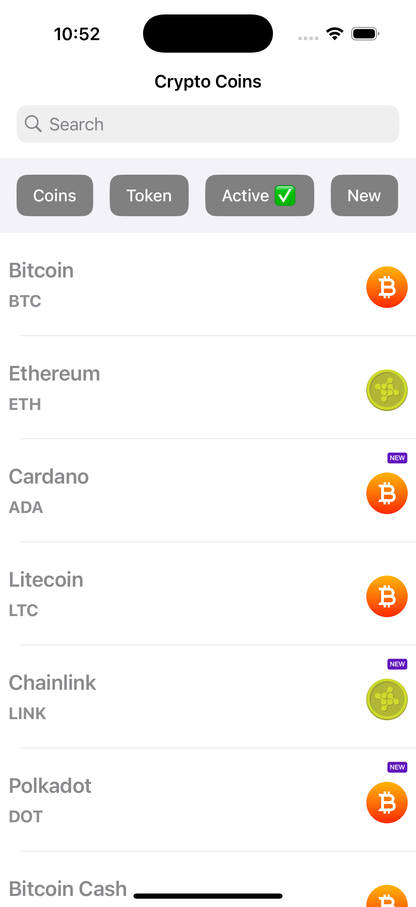

### Crypto Coins
1. List crypto coins with details:
  Name, Symbol, and Type (e.g., Coin/Token).

2. Search by name.
3. Filter:
   By type (e.g., Coin, Token).
   By status (Active/New).

### Architecture
MVVM-C architecture with Combine for data binding.

C- Coordinator for managing app navigation flow.

### IDE and Language 
XCode 16.1, Swift 5

### Libraries
1. [SnapKit](https://github.com/SnapKit/SnapKit): For layout constraints.
2. [TagListView](https://github.com/ElaWorkshop/TagListView): For displaying filter tags
3. [Quick](https://github.com/Quick/Quick): For unit tests
4. [Nimble](https://github.com/Quick/Nimble): For unit test

Cheers!
